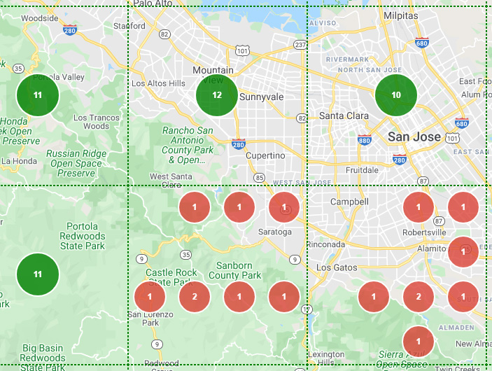

# grid_clusterer v1.5.0
<h2>A grid clusterer for Google maps</h2>
<ul>
  <li><a href="https://bdcoder2.github.io/grid_clusterer/index.html" target="_blank">Overview, examples, reference</a>
</ul>

  

<h2>To download and use locally:</h1>
<ol>
  <li>Click on the &quot;grid_clusterer.zip&quot; archive above.</li>
  <li>Click on the &quot;Download&quot; button and save the archive locally.</li>
  <li>Un-zip the grid_clusterer archive</li>
  <li><b>IMPORTANT</b>: In order to use Google maps, you require a <a href="https://developers.google.com/maps/documentation/javascript/get-api-key">Google maps API key</a>.
    
Replace the string &quot;<b>[YOUR_API_KEY]</b>&quot; with your Google maps API key in all "index.html" files found in the following directories:

    <ul>
      <li>./dist/ex0/index.html</li>
      <li>./dist/ex1/index.html</li>
      <li>./dist/ex2/index.html</li>
      <li>./dist/ex3/index.html</li>
    </ul>
  </li>
  <li>Using any web browser, open the &quot;/dist/index.html&quot; file.
</ol>

